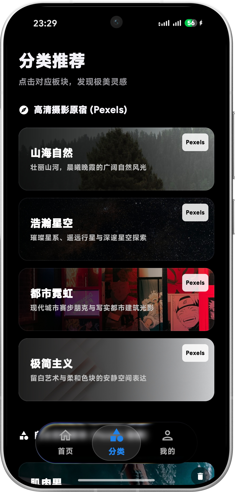

<h1 align="center">Today Wallpaper</h1>

<p align="center">
  基于 Jetpack Compose + Kotlin 构建的台历式沉浸壁纸应用
</p>

<p align="center">
  <a href="https://tdwp.btm-m.site">官网</a> ·
  <a href="README.md">English</a> ·
  <a href="https://github.com/ColdP/TodayWallpaper/releases">下载</a>
</p>

<p align="center">
  
  
  
  
</p>

---

## 截图

<p align="center">
  
  &nbsp;&nbsp;
  
  &nbsp;&nbsp;
  
</p>
<p align="center">
  <sub>首页 &nbsp;|&nbsp; 分类 &nbsp;|&nbsp; 我的</sub>
</p>

---

## 功能特性

- **台历式首页** — 以日期为轴，沉浸浏览每日精选壁纸
- **分类推荐** — 按主题与风格精心组织的壁纸合集
- **收藏与自定义图集** — 收藏喜欢的壁纸，打造专属图集
- **中英双语** — 完整支持中文 / 英文界面切换
- **桌面小组件** — 直接从桌面小组件一键设置今日壁纸

---

## 技术栈

| 层级 | 技术 |
|---|---|
| UI | Jetpack Compose + Material 3 |
| 语言 | Kotlin |
| 架构 | MVVM + Repository |
| 导航 | Navigation Compose |
| 网络 | Retrofit 2 + OkHttp + Moshi |
| 图片加载 | Coil |
| 本地存储 | Room |
| 小组件 | Glance |
| 构建 | Gradle Version Catalogs (libs.versions.toml) |

---

## 快速开始

### 环境要求

- Android Studio Narwhal (2025.1) 或更高版本
- JDK 11+
- Android SDK 37

### 配置 API Key

本应用使用 Gemini API 实现 AI 相关功能，需要自行提供密钥。

1. 前往 [Google AI Studio](https://aistudio.google.com/app/apikey) 获取 API Key。
2. 在项目根目录将 `.env.example` 复制为 `.env`：
   ```bash
   cp .env.example .env
   ```
3. 将 `.env` 中的占位值替换为你的真实密钥：
   ```
   GEMINI_API_KEY=YOUR_API_KEY_HERE
   ```

### 构建

```bash
# 克隆仓库
git clone https://github.com/ColdP/TodayWallpaper.git
cd TodayWallpaper

# 构建 Debug APK
./gradlew assembleDebug

# 构建 Release APK（需配置签名环境变量）
./gradlew assembleRelease
```

Release 签名需要以下环境变量：

| 变量 | 说明 |
|---|---|
| `KEYSTORE_PATH` | `.jks` 签名文件的绝对路径 |
| `STORE_PASSWORD` | Keystore 密码 |
| `KEY_PASSWORD` | Key 密码 |

---

## 目录结构

```
TodayWallpaper/
├── app/
│   └── src/
│       └── main/
│           ├── java/btm/m/todaywallpaper/   # Kotlin 源码
│           └── res/                          # 资源文件
├── gradle/
│   └── libs.versions.toml                   # 版本目录
├── images/                                  # README 图片资源
├── .env.example                             # API Key 模板
├── build.gradle.kts
└── settings.gradle.kts
```

---

## 贡献

欢迎提交 Pull Request！若涉及较大改动，请先开 Issue 讨论。

---

## 许可证

本项目基于 [MIT 许可证](LICENSE) 开源。

---

<p align="center">
  Made with ❤️ by <a href="https://btm-m.site">btm_m</a> ·
  <a href="https://btm-m.live">博客</a>
</p>
